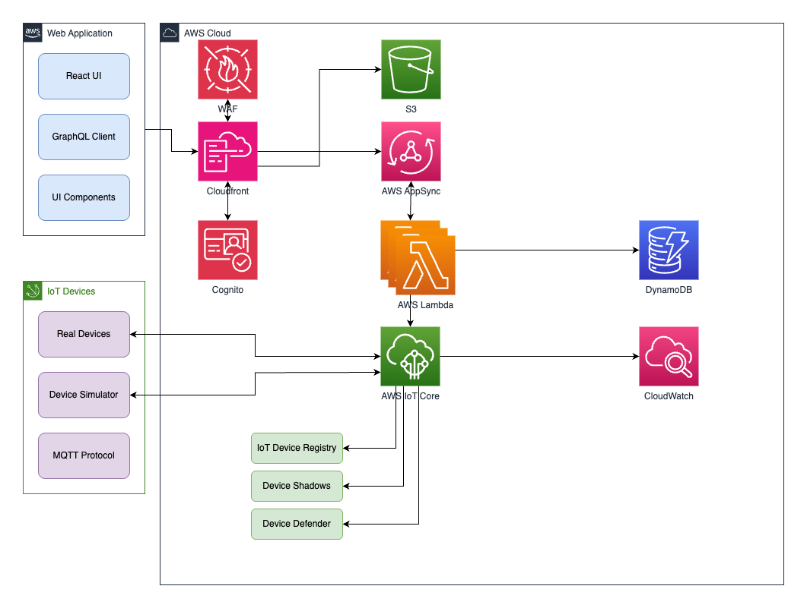

## License

Licensed to the Apache Software Foundation (ASF) under one
or more contributor license agreements.  See the NOTICE file
distributed with this work for additional information
regarding copyright ownership.  The ASF licenses this file
to you under the Apache License, Version 2.0 (the
"License"); you may not use this file except in compliance
with the License.  You may obtain a copy of the License at

  http://www.apache.org/licenses/LICENSE-2.0

Unless required by applicable law or agreed to in writing,
software distributed under the License is distributed on an
"AS IS" BASIS, WITHOUT WARRANTIES OR CONDITIONS OF ANY
KIND, either express or implied.  See the License for the
specific language governing permissions and limitations
under the License.   


# FleetWatch - IoT Fleet Management System

FleetWatch is a comprehensive IoT device fleet management system built on AWS cloud services. It enables monitoring, management, and analysis of connected devices at scale. **FleetWatch serves as sample customizable solution to help customers get started when AWS IoT FleetHub service will be discontinued starting October 2025.**. This is only sample code and it is not supposed to be used in production environments.

## Features

- **Device Monitoring**: Track connection status, metrics, and health of all devices
- **Device Shadow Management**: Manage device state through AWS IoT Device Shadows
- **Advanced Filtering**: Search and filter devices based on multiple criteria, including date-time ranges
- **User Preferences**: Store and retrieve user view preferences, including favorite devices and filters
- **Customizable Dashboards**: Create and configure personalized dashboards for monitoring
- **Device Scheduling**: Configure and manage device schedules
- **Firmware Management**: Track device firmware jobs
- **Analytics Dashboard**: Visualize fleet statistics and metrics
- **Device Simulation**: Test with simulated devices for development and testing

## System Architecture



The architecture diagram above illustrates the main components of the FleetWatch system and how they interact with each other.

## FleetHub Replacement

As AWS IoT FleetHub will be discontinued starting October 2025, FleetWatch provides a sample customizable (non-production) replacement with several enhanced capabilities:

- **Superior Filtering**: Advanced filtering capabilities including date-time ranges, which FleetHub lacked
- **User Preferences**: Ability to save and retrieve user view preferences, including favorite devices and filters
- **Customizable Dashboards**: Create personalized monitoring dashboards tailored to specific use cases
- **Enhanced Analytics**: More comprehensive device statistics and visualization options
- **Seamless Integration**: Built on the same AWS IoT Core foundation, ensuring easy migration from FleetHub
- **Extensible Architecture**: Designed to be extended with additional features as needed

## Project Structure

- **backend/**: AWS CDK infrastructure and backend services
  - **appsync/**: GraphQL API definitions and resolvers
  - **constructs/**: CDK constructs for AWS resources
  - **config/**: Configuration files for the backend
  
- **web-app/**: React-based web application
  - **src/components/**: UI components
  - **src/graphql/**: GraphQL queries and mutations
  - **src/context/**: React context providers
  - **src/hooks/**: Custom React hooks
  
- **device-simulator/**: Tools for simulating IoT devices
  
- **shared/**: Shared code and types between frontend and backend
  
- **scripts/**: Utility scripts for development and deployment

## Prerequisites

- Node.js v20
- AWS CLI configured with appropriate credentials
- AWS CDK v2
- Git

## Getting Started

### Installation

1. Clone the repository:
   ```bash
   git clone https://gitlab.com/bvvitali/fleetWatch.git
   cd fleetWatch
   ```

2. Install dependencies:
   ```bash
   npm install
   ```

2. Run the device simulator:
   ```bash
   cd device-simulator
   python3 main.py
   ```

### Deployment

1. Deploy the entire stack to AWS:
   ```bash
   npm run deploy
   ```

   This will:
   - Deploy all AWS resources using CDK
   - Generate environment files for the web application
   - Output the API endpoints and other resources

2. To destroy the deployed resources:
   ```bash
   npm run destroy
   ```

## Device Management

FleetWatch provides comprehensive device management capabilities:

- **Device Monitoring**: Monitor device connection status and health
- **Shadow Management**: Update and sync device state
- **Firmware Updates**: Manage device firmware versions
- **Grouping**: Organize devices into logical groups
- **Scheduling**: Configure device schedules for automated operations

See the [IoT-Things-Documentation.md](./IoT-Things-Documentation.md) for detailed information about device data structures and APIs.

## Development

1. Start the web application in development mode:
   ```bash
   npm run start
   ```

### Testing

Run tests:
```bash
npm test
```

## Architecture Details

FleetWatch uses a serverless architecture built on AWS services:

1. **AWS AppSync**: GraphQL API for data access
2. **AWS Lambda**: Serverless functions for business logic
3. **AWS IoT Core**: Device connectivity and management
4. **AWS CloudWatch**: Monitoring and logging
5. **AWS CDK**: Infrastructure as code

The web application is built with React and communicates with the backend through GraphQL APIs.

